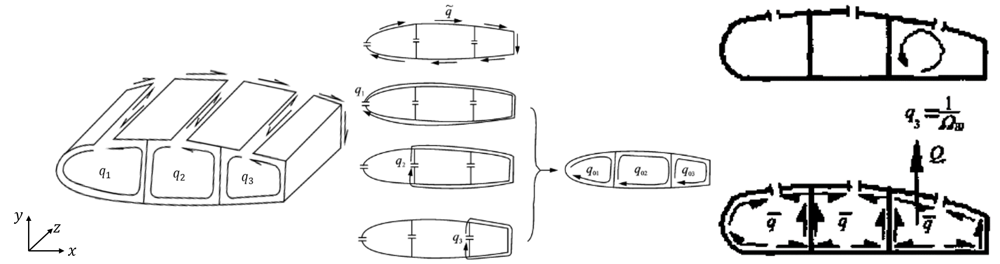
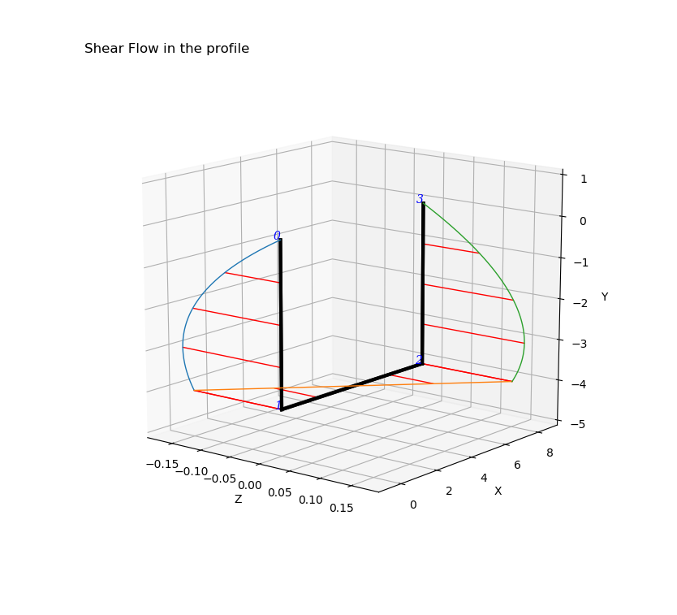
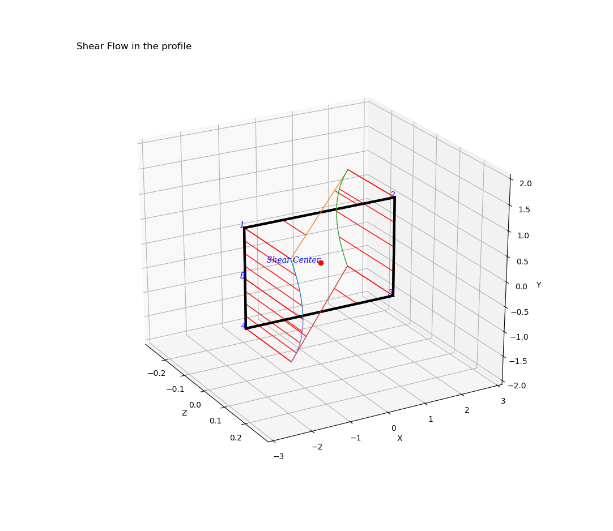
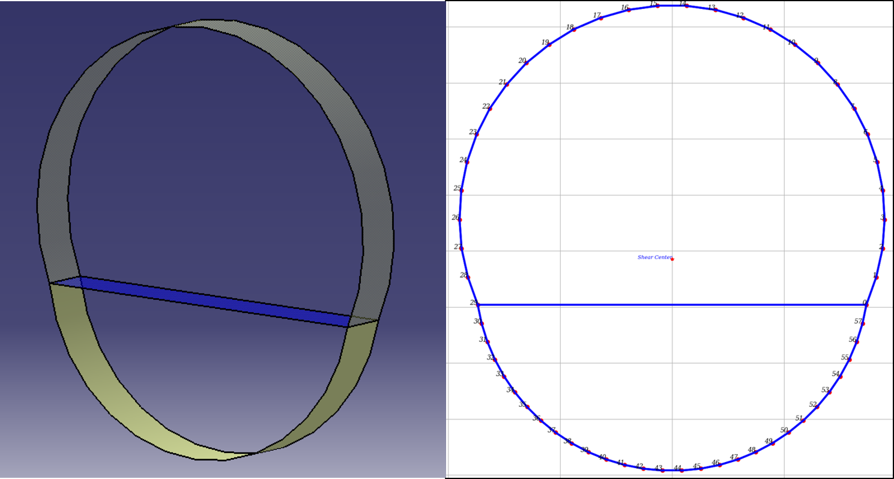

# Engineering-Beam-Section
Engineering Beam Calculation with open or closed profile
ORIGIN Project from [composite-blade-design](https://github.com/Eacaen/composite-blade-design)

# Introduction
====================

| |CN|ENG|   |
|---|----|-----|-----|
|1|`工程梁剖面剪流剪心计算`|[Engineering Beam Calculation with open or closed profile][CLT]| [Introduction](#composite-material-calculation-with-clt)|`read the program introduction for more details ` [Here](/doc/pro_introduction.pdf)  

[Running requirements](#running-requirements) | [Installation](#installation) | [License](#license) 

********************************
##### Project code for shear center&flow calculation,PARTLY FINISH.
********************************

## Project goals:
- calculate the normal stress & shaer flow & shear center of open profile or close profile with single or multi-cells.
- Use the *Engineering Beam Theory* to simplify the profile geometry properities.
- Show accurate calculate information of results, display figures of  normal stress and shear flow distribution,the number of profile node , the location of shear center.

## Data flow of the Project

## Task achieved:
- [x] calculate normal stress & shaer flow & shear center of open profile.
- [x] calculate normal stress & shaer flow & shear center of close profile of single cell.
- [x] calculate normal stress & shaer flow & shear center of close profile of multi-cells.
- [x] plot profile with different thickness. 
- [x] plot normal stress and shear flow.
- [x] report the shear flow experssion between each two nodes.
- [ ] the profile move to its centroid when calculation, the shear center is the relavite location.
- [ ] the Project just a simple demo of the Engineering Beam calculation, the deformation like  restricted torsion didn't take into consideration.
- [ ] ...

## Brief intro
### Coordinate System
 * the input xy data is the actual loation of profile, in the calculation need the Sx=Sy=0, the Jxy=0 is not necessart.

### Calculation flow chart

### Profile shear flow&center calculation
* The main package is a Python composite materials calculation package.
The calculation of laminate stress, strain and failure Criterion based on the Classical Lamination Theory ([CLT](https://en.wikipedia.org/wiki/Composite_laminates)).  

    - normal stress in profile section,
    
    ,

    - shear flow in open profile
    
    .

    - shear flow in close profile wuth three cells
    
    

## Examples

## The order of profile nodes
The Sx and Sy should calculate from the free edge of the profile, when the profile is a close one, you should choose a cut point and the order of profile nodes is very important during calculation.

*****************************************************
### Running requirements
    Python3
    Numpy
    Scipy
    Sympy
    matplotlib

### Installation         
>Copy the source files in the local directory and add the PATH in the system or copy the files to the Python's "site-packages" folder.  
>Copy the source file in you own file and develop the new function by yourself.

*****************************************************

#### Debugs log

- [x] 

